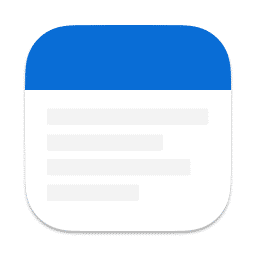
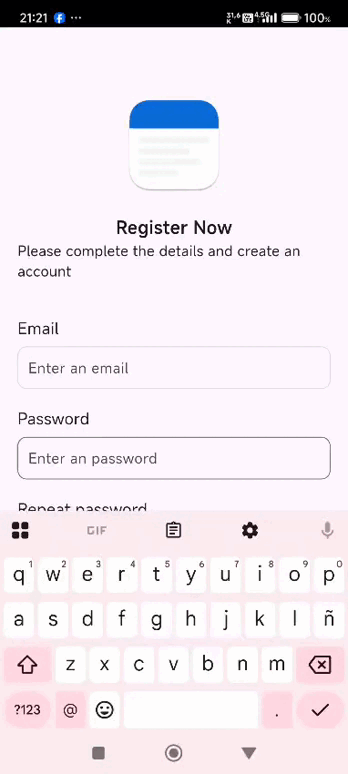

# App Task



### IOS - Android

<div style="display: flex; justify-content: space-around;">
  
</div>
</br>
<div style="display: flex; justify-content: space-around;">
  
</div>
</br>
Este proyecto ha sido desarrollado con **Flutter** y hace uso de las siguientes APIs públicas:

- 📓 [JSON Placeholder](https://jsonplaceholder.typicode.com/) para la gestión de tareas/notas.
- 👥 [REQRES](https://reqres.in/) para la simulación de datos de usuarios.

Se han implementado diversas tecnologías y bibliotecas del ecosistema Flutter para ofrecer una experiencia fluida y eficiente tanto en **iOS** como en **Android**.

## 🔑 Acceso de Prueba

📌 _Nota:_ Estos datos son proporcionados por [ReqRes API](https://reqres.in/) para testing. No requiere registro real.

1. Ve a la pantalla de **Registro**
2. Ingresa un usuario y contraseña
3. ¡Listo! Tendrás acceso.

## 🎥 Demo Visual



## Características

- **API de Usuario**: Utiliza [REQRES](https://reqres.in/) para obtener datos de usuario.
- **API de Tareas**: Utiliza [{JSON} Placeholder](https://jsonplaceholder.typicode.com/) para obtener datos de tareas.
- **Gestión de estado**: Se usa [Provider](https://pub.dev/packages/provider) para manejar el estado de la aplicación de manera eficiente y escalable.
- **Interfaz de usuario**: Combina los widgets de [Cupertino](https://flutter.dev/docs/development/ui/widgets/cupertino) y [Material Design](https://flutter.dev/docs/development/ui/widgets/material) para ofrecer una experiencia coherente en ambos sistemas operativos.
- **Enrutamiento**: Se utiliza [go_router](https://pub.dev/packages/go_router) para gestionar el enrutamiento de manera declarativa.
- **Variables de entorno**: [flutter_dotenv](https://pub.dev/packages/flutter_dotenv) se utiliza para gestionar las variables de entorno de forma segura.
- **Consumo de API**: Se emplea [Dio](https://pub.dev/packages/dio) para realizar peticiones.
- **Modos**: Cuenta con modo Oscuro disponible.
- **Idioma**: Cuenta con soporte de idoma español disponible.
- **Gestion de Tareas**: Mantenimiento de Tareas editar, insertar y eliminar, busqueda y filtrado.
- **Modo Offline**: Se podra agregar tareas en modo offline y cuando cuente con red se sincronizara de manera automatica.
- **Seguridad de datos**: Uso de flutter_secure_storage para el almacenamiento seguro de tokens.

## Paquetes utilizados

### Dependencias principales

```yaml
dependencies:
  flutter:
    sdk: flutter

  cupertino_icons: ^1.0.8
  flutter_dotenv: ^5.2.1
  go_router: ^14.2.0
  logging: ^1.2.0
  sqflite: ^2.4.2
  provider: ^6.1.4
  shared_preferences: ^2.5.3
  equatable: ^2.0.7
  dio: ^5.8.0
  meta: ^1.16.0
  json_annotation: ^4.9.0
  intl: any
  flutter_localizations:
    sdk: flutter
  flutter_secure_storage: ^9.2.2
  encrypt: ^5.0.3
  path: ^1.9.1
  shimmer: ^3.0.0
  lottie: ^3.3.1

dev_dependencies:
  build_runner: ^2.4.15
  flutter_lints: ^5.0.0
  flutter_test:
    sdk: flutter
  json_serializable: ^6.9.4
  very_good_analysis: ^5.1.0
```

# Arquitectura y gestión de estado

Provider

El proyecto usa Provider para gestionar el estado de manera eficiente y escalable, lo que permite que cualquier cambio en los datos se propague de forma reactiva a las interfaces de usuario.

go_router

Para el enrutamiento se utiliza go_router, que permite una navegación declarativa en la aplicación, facilitando la organización de las rutas y la navegación entre pantallas de forma sencilla.

# Variables de entorno

Se utiliza flutter_dotenv para manejar las claves de la API y otras configuraciones sensibles de forma segura. Asegúrate de agregar tu archivo .env en la raíz del proyecto con la clave de la API de TheCatAPI.

en la ruta hay un archivo .env.example de modelo.

# Version Dart y SDK

```bash
Flutter 3.29.2 • channel stable • https://github.com/flutter/flutter.git
Framework • revision c236373904 (4 weeks ago) • 2025-03-13 16:17:06 -0400
Engine • revision 18b71d647a
Tools • Dart 3.7.2 • DevTools 2.42.3
```
